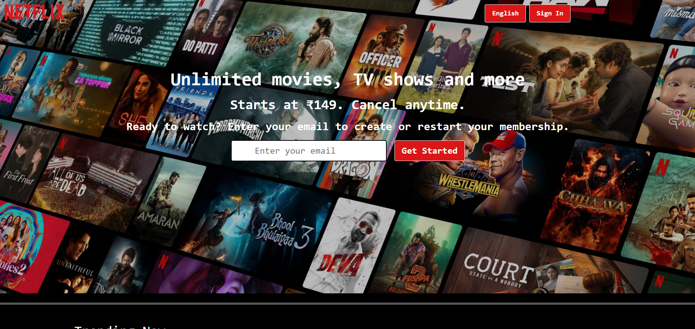
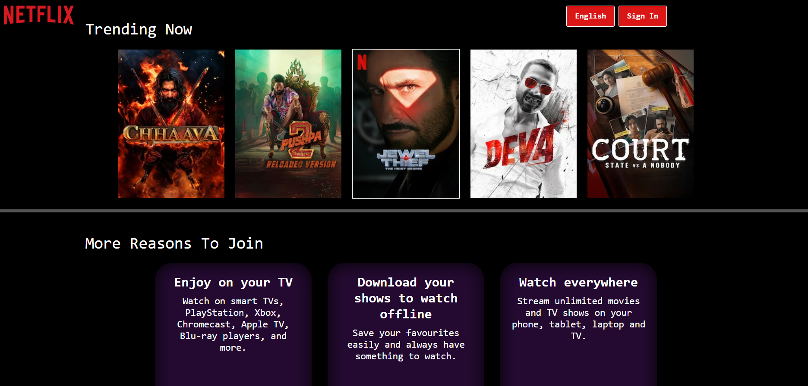
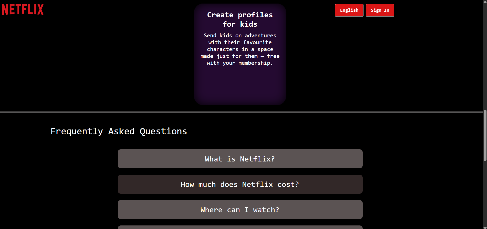
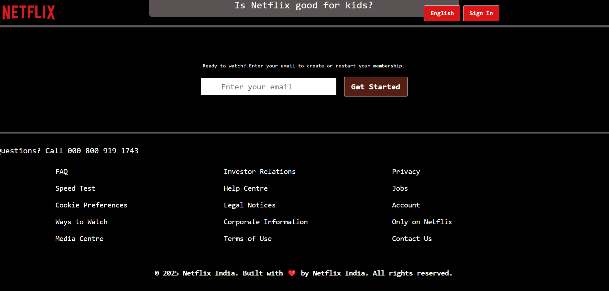

# 🎬 Netflix Clone

A responsive **Netflix homepage clone** built using **HTML** and **CSS** only.  
This project replicates the landing page of Netflix, showcasing sections like trending shows, feature highlights, FAQs, and more.

---

## 📌 Summary

This marks my **first repository**:

- Created using **pure HTML and CSS**
- Learned the structure of an HTML document and how to use various **CSS properties**
- Inspired by the **2025 version** of the Netflix landing page
- **Suggestions and contributions are most welcome!**
- A small step toward building larger and more complex projects in the future

---

## 🚀 Deployment

🔗 [Live Demo on Netlify](https://aayesshaa.netlify.app/)

---

## ⚙️ Features

- 📱 **Responsive layout** using Flexbox and media queries
- ✨ **Modern UI** with hover effects and smooth transitions
- 📺 Sections include: Hero banner, Trending shows, Feature highlights, FAQ, and Footer
- 🧼 Clean and organized HTML/CSS codebase
- ✅ Mobile, tablet, and desktop friendly

---

## 🖼 Screenshots

| Mobile | Tablet | Desktop |
|--------|--------|---------|
|  |  |  |
|  |  |  |

---

## 🛠 Technologies Used

- **HTML5** – Semantic structure and layout
- **CSS3** – Styling, layout, animations, and responsive design

---

## 📱 Responsiveness

- Fully responsive across different screen sizes
- Tested on mobile, tablet, and desktop devices

---

## 🙏 Acknowledgements

- Inspired by the **official Netflix landing page UI**

---

&copy; 2025 **Netflix Clone** – Built with ❤️ for educational purposes only.
