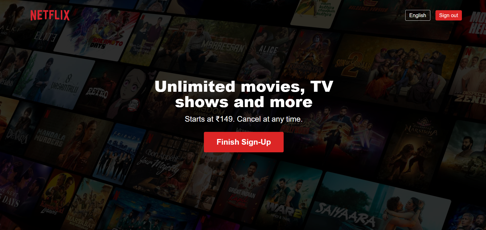
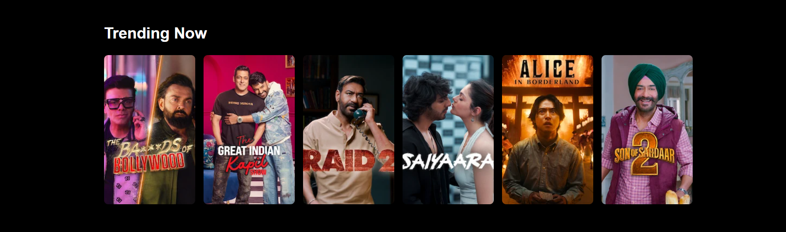
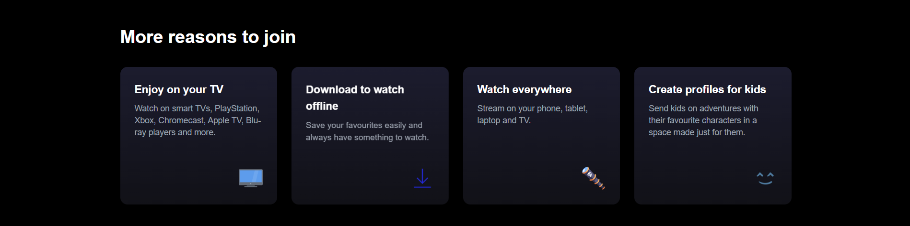
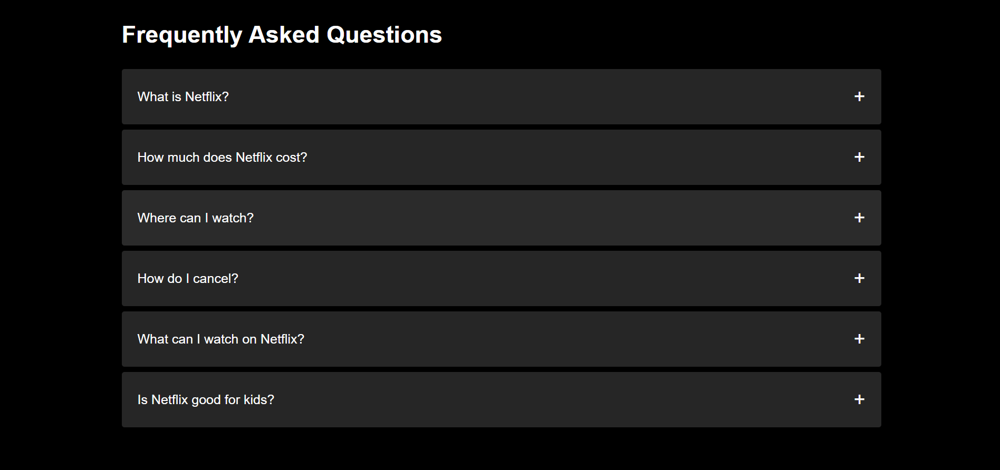
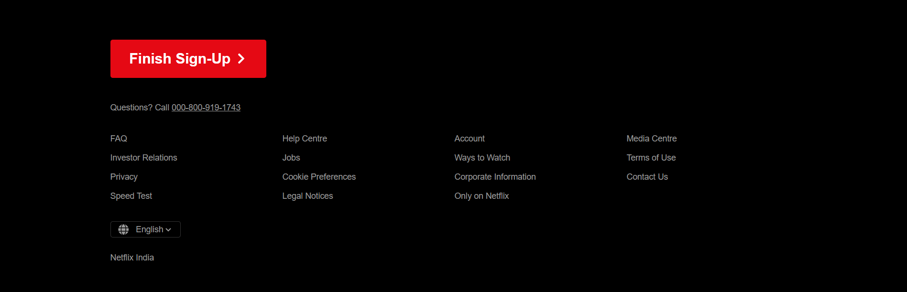

# 🎬 NextFlix - Netflix UI Clone

A modern Netflix-inspired streaming platform interface built using **Next.js, React, TypeScript, and Tailwind CSS**.

Originally developed as a basic HTML/CSS clone, NextFlix was later rebuilt using a modern React architecture focused on responsiveness, reusable components, and scalable frontend structure.

## 🌐 Live Demo

https://netflix-clone-cyan-xi-71.vercel.app/

---

## ✨ Features

- Netflix-inspired landing page
- Responsive dark-themed interface
- Trending content section
- Interactive FAQ accordion
- Reusable React components
- Optimized frontend architecture
- Smooth responsive layout

---

## 🚀 Tech Stack

- Next.js 16
- React 19
- TypeScript
- Tailwind CSS
- React Icons

---

## 📸 Screenshots

---

## 🧠 What I Learned

- Migrating static HTML/CSS projects into React applications
- Building reusable component-driven interfaces
- Structuring applications using the Next.js App Router
- Creating responsive layouts with Tailwind CSS
- Organizing scalable frontend architecture
- Working with TypeScript in React projects
- Managing modern frontend tooling and workflows

This project improved my understanding of how modern frontend applications are structured and maintained beyond static webpage development.

---

## 💡 Future Improvements

- TMDB API integration
- Authentication system
- Dynamic movie content
- Search functionality
- Watchlist support
- Video playback integration
- Backend connectivity

---

## 👩‍💻 Author

**Ayesha Ansari**

Built with ❤️ using Next.js and Tailwind CSS